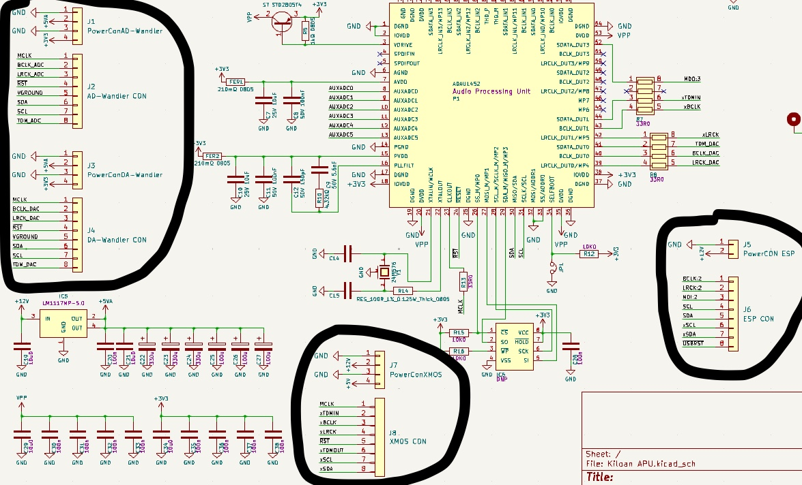

**Total time spent: 13hrs**

# June 30th - Schematics (7hrs)

I've had the idea of my own inexpensive DIY digital mixer in my head for a while. Now I've remembered it again, and I have two days left to design the mainboard. The whole thing is based on the ADAU1452, an audio DSP. This has several connectors for an analog-to-digital converter (8 channels), a digital-to-analog converter (also 8 channels), an ESP32 for controlling the audio tracks, and an XMOS chip for an 8-channel USB audio interface like the FreeDSP Aurora. The FreeDSP Aurora inspired me for this whole concept, and I learned a lot from this project. There's a power section to provide individual voltages for all the chips. The external PCB boards with the chips mentioned above all have two JST connectors to the mainboard, one for power and one for data transmission. I will develop these pcb boards when the mainboard is fully functional.

Each external PCB board (ADC/DAC converter, XMOS USB Audio, ESP32) has a power connector that supplies the required voltage. Each board also has a data connector for TDM8 connections and I2S/I2C connections to the ESP32.

Five digital pins of the ADAU1452 chip are exposed for flexibility in use; the sixth pin is used for a power-on LED. The USBi header for programming the DSP chip is shown in green. I also adopted the standard expansion header from FreeDSP (shown in red) to use their expansion boards before designing my own.

# June 31th - Layout and Routing (6hrs)

Today I placed the components on the PCB and routed them. I have no idea if everything will work, as this is my third PCB. I created individual sections to keep everything organized and added mounting solutions to secure the PCB. I think it is quite nice!

It was really complicated for me to create the traces around the DSP chips and to get all the data connections correct and, above all, AWAY from the chip to the connectors!

