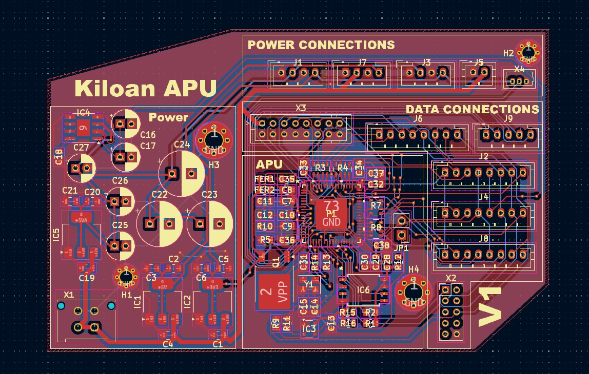

  <h1 align="center">Kiloan APU V1</h1>

  

  

  <a href="https://hackclub.com/highway">
    </img>
  </a>
  

  <h1></h1>
  

    The mainboard for a custom digital mixing console!
  

This work is licensed under the
[MIT License](https://mit-license.org).

## Table of Contents

- [About](#about)
- [Pictures](#pictures)
- [Bill of Materials](#bill-of-materials)

# About

I've always wanted my own digital mixing console, but those things are just too expensive for teenagers. That's why I want to build my own! This is the mainboard, to which additional PCB boards will later be attached. They provide inputs/outputs (balanced XLR, of course), are responsible for the controls, and serve as a USB audio interface. This is the first step in this extensive project!

# Pictures

# Bill of Materials

|Reference                                        |Value                        |Description                                                                                                                 |Qty|LCSC           |Price|FIELD7                 |
|-------------------------------------------------|-----------------------------|----------------------------------------------------------------------------------------------------------------------------|---|---------------|-----|-----------------------|
|C1                                               |25V 10u0                     |                                                                                                                            |1  |C391262        |     |                       |
|C2,C5,C13,C20,C28,C30,C31,C32,C33,C35,C36,C37,C38|CAP_100n_50V_X7R_0805        |                                                                                                                            |13 |C3018562       |     |                       |
|C3,C4,C6,C18,C19,C21,C29,C34                     |CAP_10u0_25V_X5R_0805        |                                                                                                                            |8  |C391262        |     |                       |
|C7,C10                                           |25V 10uF                     |25V 10uF X5R ±20% 0805 Multilayer Ceramic Capacitors MLCC - SMD/SMT ROHS                                                    |2  |C391262        |     |                       |
|C8,C11                                           |50V 100nF                    |50V 100nF X7R ±10% 0805 Multilayer Ceramic Capacitors MLCC - SMD/SMT ROHS                                                   |2  |C3018562       |     |                       |
|C9                                               |50V 5.6nF                    |50V 5.6nF X7R ±10% 0805 Multilayer Ceramic Capacitors MLCC - SMD/SMT ROHS                                                   |1  |C113862        |     |                       |
|C12                                              |50V 150pF                    |50V 150pF C0G ±5% 0805 Multilayer Ceramic Capacitors MLCC - SMD/SMT ROHS                                                    |1  |C2168780       |     |                       |
|C14,C15                                          |50V 12pF                     |                                                                                                                            |2  |C2168859       |     |                       |
|C16,C17,C25,C26,C27                              |CAP_100u_20%_25V_ALUM_RADIAL |                                                                                                                            |5  |C108360,C136287|     |                       |
|C22,C23,C24                                      |330u_20%_25V_ALUM_RADIAL     |                                                                                                                            |3  |C47344178      |     |                       |
|FER1,FER2                                        |210mΩ 0805                   |210mΩ ±25% 600Ω@100MHz 0805 Ferrite Beads ROHS                                                                              |2  |C85837         |     |                       |
|IC1,IC5                                          |IC_LM1117MP-5.0              |                                                                                                                            |2  |C131933        |     |                       |
|IC2                                              |IC_NCP1117LPST33             |                                                                                                                            |1  |C146799        |     |                       |
|IC3                                              |IC_ADM811TARTZ               |                                                                                                                            |1  |C462205        |     |                       |
|IC4                                              |IC_TLE2426ID                 |                                                                                                                            |1  |C59459         |     |                       |
|IC6                                              |IC_25AA1024                  |                                                                                                                            |1  |C2653525       |     |                       |
|J1                                               |PowerConAD-Wandler           |Generic connector, single row, 01x04, script generated (kicad-library-utils/schlib/autogen/connector/)                      |1  |C131334        |     |                       |
|J2                                               |AD-Wandler CON               |Generic connector, single row, 01x08, script generated (kicad-library-utils/schlib/autogen/connector/)                      |1  |C157974        |     |                       |
|J3                                               |PowerConDA-Wandler           |Generic connector, single row, 01x04, script generated (kicad-library-utils/schlib/autogen/connector/)                      |1  |C131334        |     |                       |
|J4                                               |DA-Wandler CON               |Generic connector, single row, 01x08, script generated (kicad-library-utils/schlib/autogen/connector/)                      |1  |C157974        |     |                       |
|J5                                               |PowerCON ESP                 |Generic connector, single row, 01x02, script generated (kicad-library-utils/schlib/autogen/connector/)                      |1  |C131337        |     |                       |
|J6                                               |ESP CON                      |Generic connector, single row, 01x08, script generated (kicad-library-utils/schlib/autogen/connector/)                      |1  |C157974        |     |                       |
|J7                                               |PowerConXMOS                 |Generic connector, single row, 01x04, script generated (kicad-library-utils/schlib/autogen/connector/)                      |1  |C131334        |     |                       |
|J8                                               |XMOS CON                     |Generic connector, single row, 01x08, script generated (kicad-library-utils/schlib/autogen/connector/)                      |1  |C157974        |     |                       |
|J9                                               |AUXADC                       |Generic connector, single row, 01x05, script generated (kicad-library-utils/schlib/autogen/connector/)                      |1  |C157993        |     |                       |
|JP1                                              |CON_JUMPER                   |                                                                                                                            |1  |C492401        |     |                       |
|P1                                               |ADAU1452                     |Audio Processing Unit                                                                                                       |1  |C462188        |     |                       |
|Q1                                               |ST STD2805T4                 |PNP 60V 5A 150MHz 15W                                                                                                       |1  |C672201        |     |                       |
|R1,R2                                            |RES_2K00_1%_0.125W_Thick_0805|                                                                                                                            |2  |C114572        |     |                       |
|R3,R4,R7,R8                                      |33R0_5%_4x0603               |                                                                                                                            |4  |C872331        |     |                       |
|R5                                               |1kΩ 0805                     |125mW Thick Film Resistor 150V ±100ppm/℃ ±1% 1kΩ 0805 Chip Resistor - Surface Mount ROHS                                    |1  |C95781         |     |                       |
|R9                                               |RES_1K00_1%_0.125W_Thick_0805|                                                                                                                            |1  |C95781         |     |                       |
|R10                                              |4.32kΩ                       |125mW Thick Film Resistor 150V ±100ppm/℃ ±1% 4.32kΩ 0805 Chip Resistor - Surface Mount ROHS                                 |1  |C483139        |     |                       |
|R11                                              |RES_100K_1%_0.125W_Thick_0805|                                                                                                                            |1  |C96346         |     |                       |
|R12,R15,R16                                      |RES_10K0_1%_0.125W_Thick_0805|                                                                                                                            |3  |C84376         |     |                       |
|R13                                              |RES_33R0_1%_0.125W_Thick_0805|                                                                                                                            |1  |C126353        |     |                       |
|R14                                              |RES_100R_1%_0.125W_Thick_0805|                                                                                                                            |1  |C105577        |     |                       |
|X1                                               |PowerIN                      |2x2P 4P Micro-Fit(MX 3.0) Tin 3mm 2 -40℃~+105℃ 8.5A 2 3mm Brass Through Hole Through Hole,P=3mm Wire To Board Connector ROHS|1  |C277721        |     |                       |
|X2                                               |USBi                         |                                                                                                                            |1  |C18723067      |     |                       |
|X3                                               |ExpansionHeader              |                                                                                                                            |1  |C3324391       |     |                       |
|X4                                               |Power LED                    |Generic connector, single row, 01x03, script generated (kicad-library-utils/schlib/autogen/connector/)                      |1  |C122442        |     |                       |
|Y1                                               |24M576                       |                                                                                                                            |1  |C6040680       |     |                       |
|                                                 |                             |                                                                                                                            |   |               |     |Quote from LCSC: $27,07|
|                                                 |                             |                                                                                                                            |   |               |     |Quote from JLCPCB: 4.17 USD|
|                                                 |                             |                                                                                                                            |   |               |     |Quote Total: 31.24 USD|
